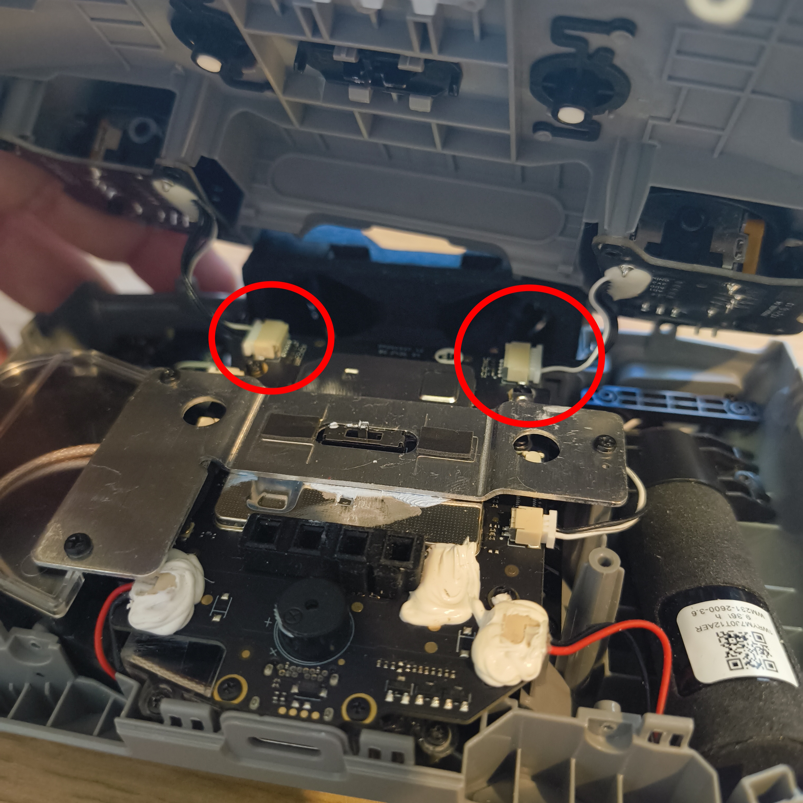
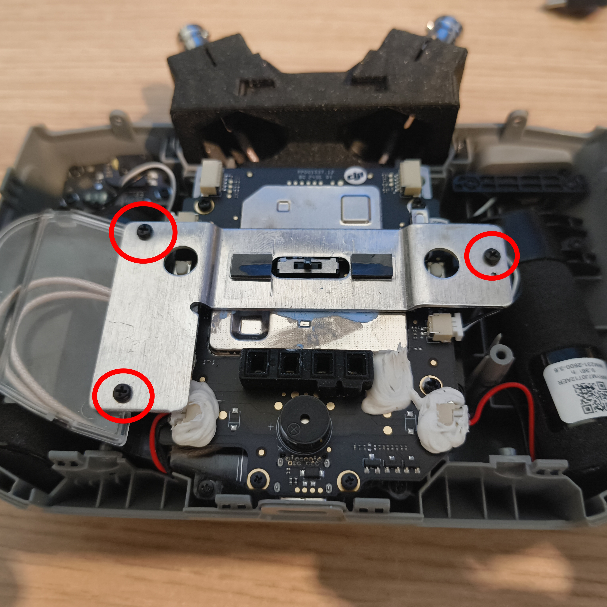
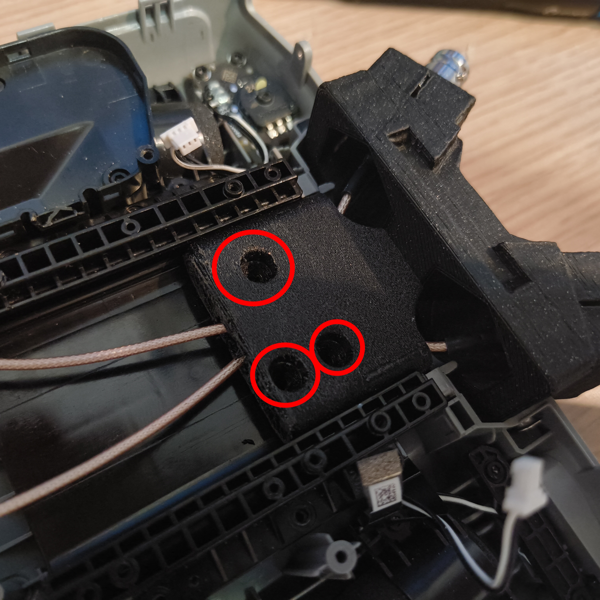

# RCN1BNCMOD

This project is about replacing the original antenna with a BNC connector on the DJI RCN1 (not tested on RCN3).

 

Parts needed (no Affiliate links) :
- [Cable](https://aliexpress.com/item/1005003822770662.html?spm=a2g0o.productlist.main.1.58d2yOewyOew8u&algo_pvid=aee48d5e-11d2-44ac-80dc-ca920e3ed368&pdp_ext_f=%7B%22order%22%3A%2234%22%2C%22eval%22%3A%221%22%7D&utparam-url=scene%3Asearch%7Cquery_from%3A)
- [tools](https://www.ifixit.com/fr-fr/products/pro-tech-go-toolkit)
- [Heated inserts M3*4mm](https://www.ruthex.de/en/collections/gewindeeinsatze/products/ruthex-gewindeeinsatz-m3-100-stuck-made-for-voron-rx-m3x5x4-messing-gewindebuchsen-fur-3d-druck)
- [M3*5 FLat head screws (7)](https://aliexpress.com/item/1005007798633538.html?spm=a2g0o.productlist.main.11.1e053b3bzOWhai&algo_pvid=ff88c89f-80c6-4083-8a48-1f996d42fa44&pdp_ext_f=%7B%22order%22%3A%224310%22%2C%22eval%22%3A%221%22%7D&utparam-url=scene%3Asearch%7Cquery_from%3A)
- Filament (any filament is fine, but I recommend PETG or PETG-CF)
- a 3D Printer
- a Drill
- a 2.8mm drill bit

Antenna Side 
- [BNC Male to RP SMA](https://aliexpress.com/item/1005007758452385.html?spm=a2g0o.productlist.main.5.3947108aQUAhFi&algo_pvid=55851f22-6f12-454e-890f-814c01c199c4&pdp_ext_f=%7B%22order%22%3A%22177%22%2C%22eval%22%3A%221%22%7D&utparam-url=scene%3Asearch%7Cquery_from%3A)
- [Antenna](https://alfa-network.eu/apa-m25) (Any Wi-Fi antenna should work — just make sure it supports both 2.4 GHz and 5.8 GHz bands)

🛑 Disclaimer:
I won’t cover how to open the RCN1 here, because disassembly will void your warranty.
However, I will show you how to install the mod once it’s open.

1️⃣ Once the controller is open, disconnect the joysticks.

2️⃣ Unscrew these three screws.

3️⃣ You now have access to the PCB.
(Ignore the modded state of my controller. I’ve already done the mod and don’t have a second RCN1 to show from scratch. The process is the same.)
Disconnect all connectors and remove the screws.
Remove the batteries first.
Be careful with the flex connector under the cage.

4️⃣ Remove the motherboard.
Then unscrew these two screws and remove the two transparent parts.

At this point, your setup should look similar to mine, except you'll still have the original antenna attached.

5️⃣ Remove the antenna holder by unscrewing these six screws.

Now you have this piece out:

Place it back **without screwing it in**.

**Assembling the BNC Connector**
6️⃣ Install the heated insert into the main part, then mount the BNC connector.

7️⃣ On the internal support, install the heated insert and pass the cables through the holes.
It’s a bit tedious, but there’s enough space. Just be gentle to avoid damaging the connectors.

8️⃣ Assemble both parts using two M3*5 screws in these holes.

9️⃣ Slide the BNC assembly into the holder.

🔟 Mark the three small holes using the 2.8mm drill bit by hand.

1️⃣1️⃣ Remove everything and drill the holes properly.
Then use a screw to cut threads into the plastic and secure everything into place.

1️⃣2️⃣ Route the cables as shown.
You may need to trim some plastic from the transparent parts to accommodate the thicker cables.

1️⃣3️⃣ Reassemble everything.
Note: there’s no special place for the U.FL connector — route it carefully.

⚠ Don’t forget to connect the antenna before powering on the controller!

Shield: [![CC BY-NC-SA 4.0][cc-by-nc-sa-shield]][cc-by-nc-sa]

This work is licensed under a
[Creative Commons Attribution-NonCommercial-ShareAlike 4.0 International License][cc-by-nc-sa].

[![CC BY-NC-SA 4.0][cc-by-nc-sa-image]][cc-by-nc-sa]

[cc-by-nc-sa]: http://creativecommons.org/licenses/by-nc-sa/4.0/
[cc-by-nc-sa-image]: https://licensebuttons.net/l/by-nc-sa/4.0/88x31.png
[cc-by-nc-sa-shield]: https://img.shields.io/badge/License-CC%20BY--NC--SA%204.0-lightgrey.svg
